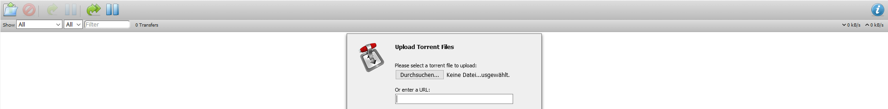

## REST API for the leaked BreachCompilation credentials

**BreachCompilation** includes billion clear text credentials discovered in a single database
(file size: ~42GB). The aim of this repo is to create a REST API interface similar to the [ghostproject](https://ghostproject.fr/) 

- [Application BreachCompilationRestAPI]()
- [BreachCompilation structure and usage]()
- [Download BreachCompilation via transmission software]()
- [Create database for the BreachCompilation Collection]()

 

## Installation
installation from source

<pre><code>
sudo python3 setup.py release install
</code></pre>

execute command line script
<pre><code>
BreachCompilationApp
</code></pre>

or use the systemd service file
<pre><code>
sudo systemctl status BreachCompilationApp.service
</code></pre>

 

 

or build a rpm file to deploy it on a server
<pre><code>
sudo apt install rpm alien
</code></pre>

create a release rpm package with setup.py
<pre><code>
sudo python3 setup.py release bdist_rpm
</code></pre>

change into folder `dist`
<pre><code>
sudo alien -i BreachCompilationRestAPI-1.0.0-1.noarch.rpm
</code></pre>

copy the rpm file to target server and install the rpm package with the alien tool  
<pre><code>
sudo alien -i BreachCompilationRestAPI-1.0.0-1.noarch.rpm
</code></pre>

or create first a debian package and install with `dpkg -i`
<pre><code>
sudo alien BreachCompilationRestAPI-1.0.0-1.noarch.rpm
sudo dpkg -i breachcompilationrestapi_1.0.0-2_all.deb
</code></pre>

execute command line script
<pre><code>
BreachCompilationApp
</code></pre>

or use the systemd service file
<pre><code>
sudo systemctl status BreachCompilationApp.service
</code></pre>

### BreachCompilation structure and usage
<pre><code>
BreachCompilation/
    data/
        0/
            0
            1
            .
            z
        1/
        .
        9/
        a/
            0
            .
            b (example)
            .
            z
        .
        z/
    old/
    count_total.sh
    imported.log
    query.sh
    README
    sorter.sh
    splitter.sh
</code></pre>

each file includes email adresses and passwords(email and password are seperated with `:`) starting with a specific letter. Example entry in folder
**a/** and file **b**. 
<pre><code>
AB-HK@hotmail.com:apple1
</code></pre>

 

### Download BreachCompilation via transmission software

you can obtain this large dataset with this **magnet link**
<pre><code>
magnet:?xt=urn:btih:7ffbcd8cee06aba2ce6561688cf68ce2addca0a3&dn=BreachCompilation&tr=udp%3A%2F%2Ftracker.openbittorrent.com%3A80&tr=udp%3A%2F%2Ftracker.leechers-paradise.org%3A6969&tr=udp%3A%2F%2Ftracker.coppersurfer.tk%3A6969&tr=udp%3A%2F%2Fglotorrents.pw%3A6969&tr=udp%3A%2F%2Ftracker.opentrackr.org%3A1337
</code></pre>

but first install transmission software collection
<pre><code>
sudo apt-get install transmission-cli  transmission-common transmission-daemon
</code></pre>

stop the transmission daemon when changing the configuration file
<pre><code>
sudo systemctl stop transmission-daemon.service
</code></pre>

edit `setting.json` in `/etc/transmission-daemon`

this must be changed for remote access (192.168 have to match your private ip address range)

<pre><code>
"rpc-whitelist": "127.0.0.1,192.168.*.*",
</code></pre>

this parameter has to be changed that the account user have full access to files/folders created by Transmission (default 18).
<pre><code>
"umask": 2,
</code></pre>

add your prefered download directory
<pre><code>
"download-dir": "/home/christian/Downloads/BreachCompilation",
</code></pre>

<pre><code>
"incomplete-dir": "/home/christian/Downloads/BreachCompilation",
</code></pre>

after configuration change, restart the transmission daemon
<pre><code>
sudo systemctl restart transmission-daemon.service
</code></pre>

Open your browser and add the magnet link

<pre><code>
http://server-ip:9091/transmission/web/
</code></pre>

default username: transmission  
default password: transmission

finally insert the magnet link in the url field

   
  

 

### Create a database for the BreachCompilation credentials

install PostgreSQL dependencies via apt

<pre><code>
sudo apt-get install postgresql libpq-dev postgresql-client postgresql-client-common
</code></pre>

Follow this [tutorial](https://www.digitalocean.com/community/tutorials/how-to-install-and-use-postgresql-on-ubuntu-18-04) to set up a 
postgresql environment. For graphical visualization install [pgAdmin4](https://www.pgadmin.org/download/).
 

Use the script [breachcompilation_to_postgresql.py](BreachCompilationDatabase/BreachCompilationDatabase) 
to create subsequent database structure

- execute script in background 
<pre><code>
nohup ./BreachCompilationDatabase --host localhost --port 5432 --user christian --password test1234 --schema breachcompilation --path /home/christian/BreachCompilation &>/dev/null &
</code></pre>

## index only scan to increase query perfomance

create an index only scan
<pre><code>
CREATE index idx_pass_email on test."d"(email, password);
</code></pre>

vacuum the table, so that the visibility map to be up-to-date
<pre><code>
VACUUM test."d";
</code></pre>

http://wiki.postgresql.org/wiki/Tuning_Your_PostgreSQL_Server

